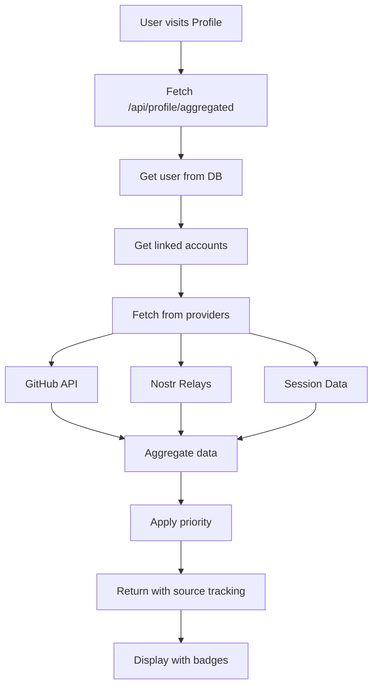
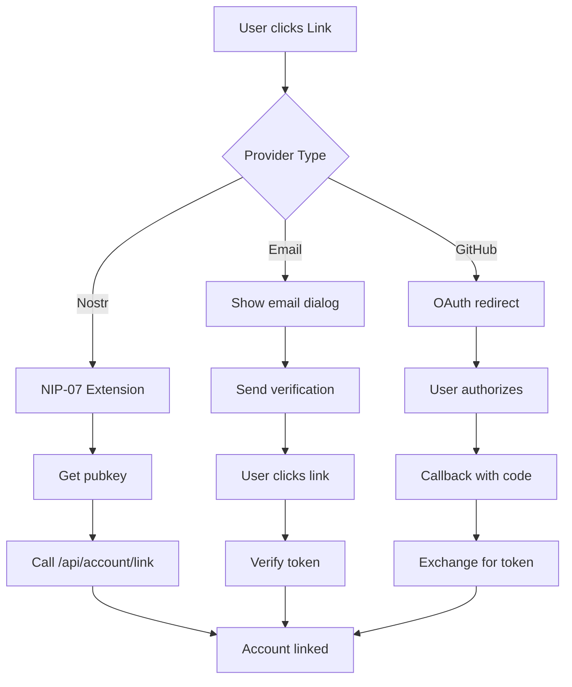

# Profile & Settings Implementation Guide

## System Overview

The profile and settings system provides a comprehensive multi-account management solution that allows users to link multiple authentication providers (Nostr, GitHub, Email) while maintaining control over their data authority and profile source preferences.

## Key Features

### 1. Multi-Provider Account Linking
- **Nostr**: Via NIP-07 browser extension
- **Email**: With verification flow  
- **GitHub**: OAuth 2.0 integration
- Prevents duplicate linking
- Current provider auto-disabled

### 2. Profile Data Aggregation
- Fetches data from all linked accounts
- Applies priority based on user preferences
- Shows data source with visual badges
- Real-time API fetching for fresh data

### 3. Intelligent Settings Management
- OAuth-first users can edit basic fields
- Nostr-first users have read-only basic fields
- Enhanced fields editable by all users
- Profile source configuration

### 4. Cross-Provider Sync
- Manual sync from any provider
- Fetches latest data via APIs
- Updates local profile
- Respects data priority

## Component Structure

```
/src/app/profile/
├── page.tsx                              # Profile page with tabs
├── actions.ts                            # Server actions
└── components/
    ├── enhanced-profile-display.tsx     # Profile tab UI
    ├── simple-settings.tsx               # Settings tab UI
    └── profile-tabs.tsx                  # Tab navigation

/src/components/account/
└── linked-accounts.tsx                   # Account linking UI

/src/lib/
├── profile-aggregator.ts                 # Data aggregation logic
├── account-linking.ts                    # Linking utilities
└── auth.ts                               # Authentication config

/src/app/api/
├── profile/
│   └── aggregated/                       # Aggregated profile endpoint
└── account/
    ├── linked/                           # Get linked accounts
    ├── link/                             # Link new account
    ├── unlink/                           # Unlink account
    ├── preferences/                      # Account preferences
    ├── sync/                             # Sync from provider
    ├── link-oauth/                       # OAuth initiation
    ├── oauth-callback/                   # OAuth completion
    ├── send-link-verification/           # Email verification
    └── verify-email-link/                # Complete email link
```

## Data Flow Architecture

### Profile Display Flow



### Account Linking Flow



## Implementation Details

### Profile Aggregation Logic

The profile aggregator (`/src/lib/profile-aggregator.ts`) implements intelligent data merging:

```typescript
// Priority determination
const isNostrFirst = user.profileSource === 'nostr' || 
  (!user.profileSource && user.primaryProvider === 'nostr')

// Priority order
const prioritizedAccounts = isNostrFirst
  ? [nostrAccounts, currentData, oauthAccounts]
  : [currentData, oauthAccounts, nostrAccounts]

// Field aggregation
for (const account of prioritizedAccounts) {
  if (account.data.name && !aggregated.name) {
    aggregated.name = { 
      value: account.data.name, 
      source: account.provider 
    }
  }
  // ... other fields
}
```

### Settings Component

The simplified settings (`simple-settings.tsx`) provides focused functionality:

```typescript
// Account type detection
const isNostrFirst = !user.privkey
const canEditBasic = !isNostrFirst

// Conditional rendering
{canEditBasic && (
  <BasicProfileForm />
)}

// All users
<EnhancedProfileForm />
<ProfileConfiguration />
<SyncOptions />
```

### Account Linking Security

Email verification ensures secure linking:

```typescript
// Generate secure token
const token = crypto.randomBytes(32).toString('hex')
const expires = new Date(Date.now() + 3600000) // 1 hour

// Store in database
await prisma.verificationToken.create({
  data: {
    identifier: `link:${userId}:${email}`,
    token,
    expires
  }
})

// Send verification email
await sendEmail({
  to: email,
  subject: 'Link your email account',
  html: `Click to verify: ${url}/api/account/verify-email-link?token=${token}`
})
```

### Provider Data Fetching

Each provider has specific fetch logic:

```typescript
// GitHub
async function fetchGitHubProfile(accessToken: string) {
  const response = await fetch('https://api.github.com/user', {
    headers: { 'Authorization': `Bearer ${accessToken}` }
  })
  return response.json()
}

// Nostr
async function fetchNostrProfile(pubkey: string) {
  const event = await relayPool.get(
    relays,
    { kinds: [0], authors: [pubkey] }
  )
  return event ? JSON.parse(event.content) : null
}
```

## UI/UX Patterns

### Visual Provider Indicators

Every field shows its data source:

```tsx
<div className="flex items-center gap-2">
  <span>Name: {profile.name?.value}</span>
  <Badge variant="outline">
    <GitHub className="h-3 w-3" />
    GitHub
  </Badge>
</div>
```

### Loading States

Skeleton UI during data fetching:

```tsx
{loading ? (
  <Skeleton className="h-64 w-full" />
) : (
  <ProfileContent />
)}
```

### Toast Notifications

User feedback for all operations:

```tsx
toast({
  title: 'Account Linked',
  description: 'GitHub account linked successfully'
})
```

### Disabled State with Tooltip

Current provider indication:

```tsx
<TooltipProvider>
  <Tooltip>
    <TooltipTrigger asChild>
      <Button disabled>Link GitHub</Button>
    </TooltipTrigger>
    <TooltipContent>
      You are currently signed in with GitHub
    </TooltipContent>
  </Tooltip>
</TooltipProvider>
```

## Configuration Options

### Profile Source Priority

Users can configure data priority:

```typescript
enum ProfileSource {
  NOSTR = 'nostr',   // Nostr data takes precedence
  OAUTH = 'oauth'    // OAuth data takes precedence
}
```

### Primary Provider

Determines main authentication:

```typescript
interface UserPreferences {
  primaryProvider: string    // 'github' | 'nostr' | 'email'
  profileSource: ProfileSource
}
```

## Testing Guidelines

### Unit Testing

Test aggregation logic:

```typescript
describe('ProfileAggregator', () => {
  it('respects nostr-first priority', async () => {
    const profile = await getAggregatedProfile(userId)
    expect(profile.name?.source).toBe('nostr')
  })
  
  it('handles missing providers gracefully', async () => {
    const profile = await getAggregatedProfile(userWithNoLinks)
    expect(profile.linkedAccounts).toHaveLength(0)
  })
})
```

### Integration Testing

Test API endpoints:

```typescript
describe('Account APIs', () => {
  it('links new account successfully', async () => {
    const response = await fetch('/api/account/link', {
      method: 'POST',
      body: JSON.stringify({
        provider: 'nostr',
        providerAccountId: 'npub1...'
      })
    })
    expect(response.ok).toBe(true)
  })
})
```

### E2E Testing

Test user flows:

```typescript
describe('Account Linking Flow', () => {
  it('completes email verification', async () => {
    // 1. Click link email
    await page.click('[data-test="link-email"]')
    
    // 2. Enter email
    await page.fill('[data-test="email-input"]', 'test@example.com')
    
    // 3. Submit
    await page.click('[data-test="send-verification"]')
    
    // 4. Check for success message
    await expect(page.locator('.toast')).toContainText('Verification sent')
  })
})
```

## Troubleshooting

### Common Issues

#### 1. GitHub OAuth redirect_uri error
**Problem**: GitHub app not configured for callback URL
**Solution**: Add `/api/account/oauth-callback` to GitHub app settings or use separate app with `GITHUB_LINK_CLIENT_ID`

#### 2. Email verification not working
**Problem**: Email server not configured
**Solution**: Set `EMAIL_SERVER` and `EMAIL_FROM` environment variables

#### 3. Nostr profile not syncing
**Problem**: Relays not responding
**Solution**: Check relay connectivity, try different relays

#### 4. Profile data not updating
**Problem**: Cache not invalidating
**Solution**: Wait for 5-minute TTL or manually clear cache

### Debug Mode

Enable detailed logging:

```typescript
// In development
if (process.env.NODE_ENV === 'development') {
  console.log('Profile aggregation:', {
    userId,
    linkedAccounts: accounts.length,
    profileSource,
    primaryProvider
  })
}
```

## Performance Considerations

### Caching Strategy
- Aggregated profiles cached for 5 minutes
- Provider data cached separately
- Cache invalidation on updates

### Query Optimization
- Batch fetch linked accounts
- Parallel provider API calls
- Minimal database queries

### Bundle Size
- Dynamic imports for heavy components
- Tree shaking for unused code
- Lazy loading for tabs

## Security Best Practices

### Input Validation
- Zod schemas for all inputs
- Email format validation
- URL validation for images

### Authentication
- Session required for all operations
- CSRF protection via NextAuth
- Secure token generation

### Data Protection
- No private keys in responses
- Sanitized error messages
- Rate limiting on sensitive endpoints

## Migration Guide

### From Single to Multi-Account

1. **Database Migration**
```sql
ALTER TABLE users ADD COLUMN primaryProvider VARCHAR(50);
ALTER TABLE users ADD COLUMN profileSource VARCHAR(50) DEFAULT 'oauth';
```

2. **Update Authentication**
```typescript
// Add to auth callbacks
async signIn({ user, account }) {
  if (!user.primaryProvider) {
    await updateUser(user.id, {
      primaryProvider: account.provider
    })
  }
}
```

3. **Enable Linking UI**
```tsx
// Add to profile page
<LinkedAccountsManager />
```

### From Legacy Profile System

1. **Map Old Fields**
```typescript
const migrateProfile = (oldProfile) => ({
  name: { value: oldProfile.name, source: 'legacy' },
  email: { value: oldProfile.email, source: 'legacy' }
  // ... other fields
})
```

2. **Update Components**
```tsx
// Replace old profile display
- <LegacyProfile user={user} />
+ <EnhancedProfileDisplay session={session} />
```

3. **Add Provider Badges**
```tsx
// Show data sources
<ProviderBadge source={field.source} />
```

## Future Roadmap

### Planned Features
1. **WebAuthn Support** - Passkey authentication
2. **Twitter/X Integration** - OAuth linking
3. **Field-Level Selection** - Choose provider per field
4. **Bulk Operations** - Link/unlink multiple at once
5. **API Keys** - Programmatic access
6. **Webhooks** - Profile change notifications

### Architecture Improvements
1. **GraphQL API** - Flexible data fetching
2. **Real-time Updates** - WebSocket subscriptions
3. **Edge Caching** - Global performance
4. **Event Sourcing** - Profile change history
5. **CQRS Pattern** - Separate read/write models